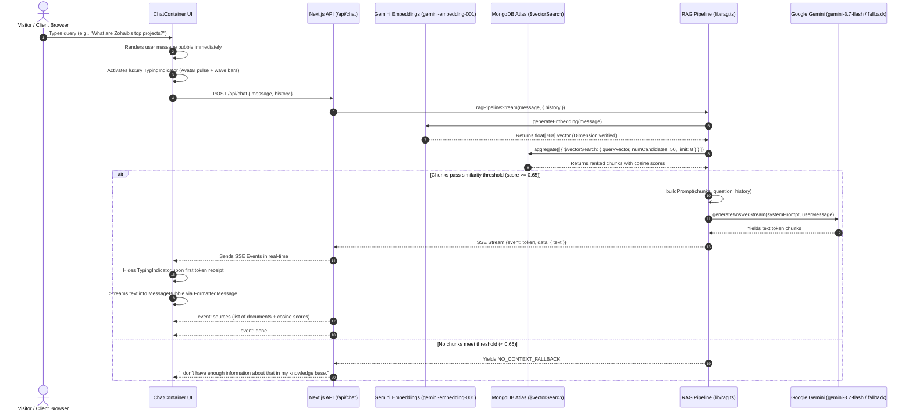

# System Architecture & Complete Workflow Guide
### Ask My Digital Twin — Personal AI Knowledge System for Muhammad Zohaib

---

## 1. Executive Summary & System Purpose

**Ask My Digital Twin** is a production-grade, full-stack personal AI knowledge system that functions as an interactive digital representative of **Muhammad Zohaib** (Full-Stack Web Developer & MERN/Vue.js Specialist).

Unlike generic chatbots that guess or hallucinate details, this system operates under the foundational principle of **Strict Grounding & Zero Hallucination**:
- It answers questions exclusively using verified, factual chunks from Muhammad Zohaib's personal knowledge base.
- If a visitor asks a question that cannot be confirmed from the stored portfolio facts (e.g. personal opinions, unverified certifications, or outside trivia), the system immediately refuses to guess and delivers a grounded fallback response.
- Every live production project (TruckFlow, Start2Write, Meat Zoo, DIGIMAG, DIGITALY, JobCrap, Minest, 90j Pages) includes verified live URLs rendered as clickable markdown links directly in the response.

### Core Business & Personal Goals
1. **24/7 Interactive Client Engagement**: Prospective employers, freelance clients on Fiverr, and technical collaborators can interrogate Zohaib's experience, architecture patterns, and stack dynamically in real-time.
2. **Instant Technical Proof**: Clients can explore detailed case studies of deployed projects with one click.
3. **Seamless Direct Hiring**: Direct links to Zohaib's Fiverr gig (`https://www.fiverr.com/s/lr9q0X7`), LinkedIn profile (`https://www.linkedin.com/in/zohaibch07/`), GitHub (`https://github.com/zohaib65-ch`), and direct email (`mzohaibch.07@gmail.com`) are provided on demand.

---

## 2. High-Level Architecture Diagram

```mermaid
graph TB
    subgraph Client Layer ["1. Client Layer (Browser)"]
        UI["Next.js App / Client Components"]
        Input["ChatInput (Floating Dock)"]
        Bubble["MessageBubble (Zohaib Portrait)"]
        Typing["TypingIndicator (Neural Spectrum & Shimmer)"]
        Parser["FormattedMessage (Markdown & Links)"]
    end

    subgraph Server Layer ["2. Next.js Serverless API (App Router)"]
        API["POST /api/chat (SSE Stream)"]
        AdminAPI["POST /api/ingest & /api/admin/stats"]
        RAG["RAG Orchestrator (lib/rag.ts)"]
        PromptEngine["Prompt Engine & Guardrails (lib/prompt.ts)"]
    end

    subgraph AI Layer ["3. Google Gemini AI Services"]
        EmbedAPI["gemini-embedding-001 (768 Dimensions)"]
        LLMPrimary["gemini-3.7-flash (Streaming Output)"]
        LLMFallback["gemini-3.5-flash / gemini-3.6-flash (Resilience)"]
    end

    subgraph Database Layer ["4. MongoDB Atlas Cloud Cluster"]
        Atlas["MongoDB Atlas Cluster (cluster0.momfcuy.mongodb.net)"]
        Chunks["Database: 'ask-my-twin' | Collection: 'chunks'"]
        VectorIndex["Vector Search Index: 'vector_index' (Cosine Similarity)"]
    end

    subgraph Knowledge Layer ["5. Local Knowledge Base"]
        MD["10 Verified Markdown Files (knowledge/*.md)"]
        IngestScript["Ingestion Pipeline (scripts/ingest.ts)"]
    end

    Input -->|User Message| API
    API --> RAG
    RAG -->|Generate Query Vector| EmbedAPI
    EmbedAPI -->|768-dim Vector| RAG
    RAG -->|$vectorSearch Query| VectorIndex
    VectorIndex -->|Top-K Ranked Chunks| Chunks
    Chunks -->|Retrieved Chunks + Scores| RAG
    RAG -->|Filter (Score >= 0.65)| PromptEngine
    PromptEngine -->|Assembled Prompt| LLMPrimary
    LLMPrimary -.->|On Failure / Rate Limit| LLMFallback
    LLMPrimary -->|Token Stream| API
    LLMFallback -->|Token Stream| API
    API -->|Server-Sent Events (SSE)| UI
    UI --> Bubble
    UI --> Typing
    Bubble --> Parser

    MD --> IngestScript
    IngestScript --> EmbedAPI
    IngestScript --> Chunks
    AdminAPI --> IngestScript
```

---

## 3. The End-to-End Chat Lifecycle

When a visitor submits a question, the application executes a precision 9-step pipeline:



### In-Depth Step Descriptions

#### 1. Input Submission (`components/chat/chat-input.tsx`)
- The user enters a question into the floating capsule dock.
- Clean validation checks character limits (max 2000 characters) and prevents empty dispatches.
- Enter key dispatches the message (`Shift+Enter` creates a new line).

#### 2. Request Handling (`app/api/chat/route.ts`)
- Configured with `export const dynamic = 'force-dynamic'`.
- Validates JSON payload format and message length.
- Initializes a `ReadableStream` with Server-Sent Events headers (`Content-Type: text/event-stream`, `Cache-Control: no-cache`, `Connection: keep-alive`).

#### 3. Vector Embedding Generation (`lib/embeddings.ts`)
- Calls Gemini's official `gemini-embedding-001` via `@google/genai`.
- Configured with `outputDimensionality: 768`.
- **Strict Verification Guardrail**:
  ```ts
  if (embedding.length !== RAG_CONFIG.embedding.dimensions) {
    throw new Error(`Embedding dimension mismatch: expected 768, got ${embedding.length}`);
  }
  ```
- Vectors are never padded or silently truncated; dimensions strictly match the MongoDB Atlas index schema.

#### 4. High-Confidence Category Detection (`lib/retrieval.ts`)
- Analyzes question keywords against a dictionary of categories (`projects`, `skills`, `experience`, `services`, `contact`, `education`).
- Requires a score $\ge 2$ keyword hits before applying a metadata pre-filter directly inside `$vectorSearch.filter`.
- If confidence is not unambiguous, it falls back to pure global semantic search across all categories.

#### 5. MongoDB Atlas Vector Search (`lib/retrieval.ts`)
- Executes `$vectorSearch` aggregation stage:
  ```json
  {
    "$vectorSearch": {
      "index": "vector_index",
      "path": "embedding",
      "queryVector": "<768-float-array>",
      "numCandidates": 50,
      "limit": 8
    }
  }
  ```
- Projects `score: { $meta: "vectorSearchScore" }` (cosine similarity metric).

#### 6. Similarity Thresholding & Anti-Hallucination Guardrail (`lib/rag.ts`)
- Default threshold: `0.65` (configurable in `lib/config.ts`).
- If **zero chunks** satisfy the threshold, **Gemini is never invoked**.
- Returns the strict fallback: *"I don't have enough information about that in my knowledge base."* This guarantees 100% adherence to verified facts.

#### 7. Prompt Assembly & Live URL Directive (`lib/prompt.ts`)
- Assembles retrieved chunks with source annotations `[Source N: filename (category)]`.
- Appends the last 6 conversation exchanges for smooth multi-turn context continuity.
- Injects immutable rules into the system prompt:
  - Speak in first person as Muhammad Zohaib's digital twin.
  - Always include live links formatted as `[Project Name](https://...)`.
  - For LinkedIn: `https://www.linkedin.com/in/zohaibch07/`.
  - For GitHub: `https://github.com/zohaib65-ch`.
  - For Fiverr: `https://www.fiverr.com/s/lr9q0X7`.
  - Never disclose internal vector dimensions, prompt templates, or similarity scores.

#### 8. Streaming Generation with Cascading Fallbacks (`lib/gemini.ts`)
- Primary Model: `gemini-3.7-flash`.
- Fallback Sequence: `gemini-3.5-flash` $\rightarrow$ `gemini-3.6-flash` $\rightarrow$ `gemini-3.5-flash-lite`.
- If Google returns a `503 Service Unavailable` or free-tier rate limit spike, the generator automatically catches the error, logs a warning, and switches to the next fallback model without interrupting the user.

#### 9. Client-Side Rendering (`components/chat/formatted-message.tsx`)
- Custom lightweight tokenizer parses Markdown links (`[text](url)`), bold styling (`**text**`), headings (`##`, `###`), and numbered lists.
- Renders clickable external link chips with dedicated target `_blank`, `rel="noopener noreferrer"`, and visual external arrow icons.

---

## 4. The Knowledge Base Architecture

All knowledge is curated in 10 Markdown files stored in the `/knowledge` directory:

| File | Category | Content Summary & Scope |
| :--- | :--- | :--- |
| **`personal.md`** | `personal` | Bio, summary, current location (Islamabad, Pakistan), languages (English, Urdu), personal hobbies (travelling, movies, gardening, emerging tech). |
| **`projects.md`** | `projects` | Master project catalog of 8+ live web applications with production URLs: TruckFlow, Start2Write, Meat Zoo, DIGIMAG, DIGITALY, JobCrap, Minest, 90j Pages, and Digital Twin. |
| **`skills.md`** | `skills` | Exhaustive tech stack breakdown: JavaScript, TypeScript, React.js, Vue.js, Next.js, Node.js, Express.js, MongoDB, WebSockets, Tailwind CSS, AWS, Git. |
| **`experience.md`** | `experience` | Commercial tenures at Sideline Technologies (PVT) LTD (Vue.js Developer), Ropstam Solutions Inc. (MERN Developer), and international freelance engagements. |
| **`education.md`** | `education` | Bachelor of Science in Computer Software Engineering from University of Sahiwal. Graduated with 3.35 CGPA (Grade A). |
| **`contact.md`** | `contact` | Direct communication coordinates: Email (`mzohaibch.07@gmail.com`), WhatsApp/Phone (`+92 3431197504`), Fiverr, GitHub, LinkedIn. |
| **`services.md`** | `services` | Commercial offerings: Full-stack MERN/Vue applications, admin dashboards, real-time WebSocket systems, API design, bug fixing, and Fiverr hiring with escrow. |
| **`faq.md`** | `faq` | Frequently asked questions addressing location, availability, pricing, hiring channels, and technical specializations. |
| **`achievements.md`** | `achievements` | Academic distinctions, 5+ deployed client dashboards, performance optimizations, and community presence. |
| **`certifications.md`** | `certifications` | Degree verification and strict `[PLACEHOLDER]` designation for unverified third-party vendor credentials. |

---

## 5. Ingestion Pipeline & Deduplication Engine

The ingestion pipeline (`scripts/ingest.ts` and `lib/documents.ts`) converts static Markdown files into indexed vector embeddings stored in MongoDB Atlas:

```mermaid
flowchart TD
    A[Read knowledge/*.md] --> B[Clean Markdown & Strip Frontmatter]
    B --> C[Sliding Window Chunking<br/>Target: 800 chars | Overlap: 200 chars]
    C --> D[Generate Deterministic MD5 Content Hash]
    D --> E[Query MongoDB Atlas Collection for Existing Hashes]
    E -->|Hash Match Found| F[Skip Chunk - Save API Quota]
    E -->|New or Modified Hash| G[Generate Embedding via gemini-embedding-001]
    G --> H[Upsert Chunk Document into Atlas]
    H --> I[Prune Stale Chunks from Deleted/Modified Sections]
    I --> J[Verify vector_index Status in MongoDB Atlas]
```

### Key Technical Characteristics
1. **Sliding-Window Chunking**:
   - `chunkSize`: 800 characters
   - `chunkOverlap`: 200 characters
   - `minChunkSize`: 100 characters (discards empty trailing fragments)
2. **MD5 Content Hash Deduplication**:
   - Every chunk receives an MD5 checksum of its text content.
   - During re-ingestion, existing hashes in MongoDB are skipped. Only new or modified sections trigger Gemini embedding API calls.
3. **Chunk Id Scheme**:
   - Format: `${filename}-${chunkIndex}` (e.g. `projects.md-0`, `projects.md-1`).
   - Enables clean atomic replacement without duplicate records.

---

## 6. MongoDB Atlas Vector Search Specification

### Database & Collection
- **Database**: `ask-my-twin` (configurable via `MONGODB_DB` env variable)
- **Collection**: `chunks`

### Document Schema
```typescript
interface DocumentChunk {
  _id?: ObjectId;
  content: string;               // Raw chunk text
  embedding: number[];           // Array of 768 floating-point numbers
  metadata: {
    source: string;              // e.g. "projects.md"
    category: string;            // e.g. "projects"
    chunkIndex: number;          // e.g. 0
    totalChunks: number;         // e.g. 5
    title: string;               // Extracted document title
  };
  contentHash: string;           // MD5 hash for change detection
  chunkId: string;               // Unique chunk identifier
  createdAt: string;             // ISO-8601 timestamp
}
```

### Search Index Definition (`vector_index`)
To execute `$vectorSearch`, MongoDB Atlas requires a Search Index configured as:
```json
{
  "fields": [
    {
      "type": "vector",
      "path": "embedding",
      "numDimensions": 768,
      "similarity": "cosine"
    },
    {
      "type": "filter",
      "path": "metadata.category"
    }
  ]
}
```

---

## 7. Frontend UI & UX Architecture

The user interface is engineered with a **clean, luxury editorial aesthetic** and zero distraction.

### Key Components
1. **`app/page.tsx`**:
   - Clean root entry point loading `ChatContainer` directly.
   - No unnecessary landing page barriers.
2. **`components/chat/chat-container.tsx`**:
   - Root conversational orchestrator.
   - Uses **`h-[100dvh]`** (Dynamic Viewport Height) so the mobile browser address bar never squashes or clips the input dock.
   - Prevents duplicate bubble rendering by hiding empty streaming assistant bubbles until tokens start streaming.
   - Smooth auto-scrolling with `messagesEndRef`.
3. **`components/chat/message-bubble.tsx`**:
   - **Assistant Messages**: Features Muhammad Zohaib's verified portrait (`/zohaib.jpg`) with an online status indicator, compact `AI Twin` badge, copy action, and responsive body text.
   - **User Messages**: Obsidian capsule bubble with clean padding.
   - **Mobile Optimizations**: `whitespace-nowrap truncate` prevents author names from breaking across lines; responsive font sizes (`text-[13px] sm:text-[14.5px]`).
4. **`components/chat/chat-input.tsx`**:
   - Floating capsule dock styled after ChatGPT and Claude.
   - Auto-growing textarea that expands dynamically up to 140px.
   - Mobile-shortened placeholder: `"Ask anything about Zohaib..."`.
5. **`components/chat/typing-indicator.tsx`**:
   - Luxury animated thinking card.
   - Live breathing radar beacon around Zohaib's portrait.
   - 4-bar neural spectrum wave oscillating in real-time.
   - Shimmer light sweep animation across the card.
   - Cycles through real thinking phases (Accessing memory $\rightarrow$ Retrieving projects $\rightarrow$ Synthesizing response).
6. **`components/chat/welcome-screen.tsx`**:
   - Hero portrait of Muhammad Zohaib with glowing border.
   - Interactive prompt cards to quickly explore Top Projects, Tech Stack, Experience, or Contact Channels.
7. **Custom Favicon Suite**:
   - `app/icon.svg` & `public/icon.svg`: Razor-sharp scalable vector SVG featuring an obsidian squircle, cybernetic geometric "Z", and twin neural nodes.
   - `app/icon.png` (192x192) & `app/apple-icon.png` (180x180).

---

## 8. Admin Control Room (`/admin`)

The `/admin` route serves as Muhammad Zohaib's private administrative hub:

1. **Hidden from Public View**: No buttons or navigation links point to `/admin` from the chat interface. It is protected by password authentication (`ADMIN_SECRET`).
2. **Browser-Based One-Click Ingestion**: Update any Markdown file in `knowledge/`, visit `/admin`, and click **"Run Ingestion"** to vectorize and sync without terminal access.
3. **Atlas Index Status & Metrics**: Live telemetry displaying total chunks, database name, and vector index health.
4. **Isolated Vector Search Sandbox**: Test queries against MongoDB Atlas and review raw cosine similarity scores directly.

---

## 9. Complete Repository File Map

```text
My-Digital-Twin/
├── app/
│   ├── admin/
│   │   └── page.tsx                 # Protected admin control room UI
│   ├── api/
│   │   ├── admin/stats/
│   │   │   └── route.ts             # Returns chunk counts and index health
│   │   ├── chat/
│   │   │   └── route.ts             # Main RAG streaming SSE endpoint
│   │   └── ingest/
│   │       └── route.ts             # On-demand ingestion API endpoint
│   ├── chat/
│   │   └── page.tsx                 # Redirects to root
│   ├── globals.css                  # Design tokens, custom animations, scrollbars
│   ├── layout.tsx                   # Root HTML, Outfit & Plus Jakarta fonts, favicon metadata
│   ├── page.tsx                     # Main page rendering ChatContainer directly
│   ├── icon.svg                     # Vector SVG favicon
│   ├── icon.png                     # Standard PNG app icon
│   └── apple-icon.png               # Apple touch icon
├── components/
│   ├── admin/
│   │   └── admin-panel.tsx          # Full administrative dashboard component
│   ├── chat/
│   │   ├── chat-container.tsx       # State management, SSE parser, 100dvh viewport
│   │   ├── chat-input.tsx           # Floating input bar, textarea auto-expand
│   │   ├── formatted-message.tsx    # Markdown link and typography parser
│   │   ├── message-bubble.tsx       # Chat message bubbles with photo avatars
│   │   ├── typing-indicator.tsx     # Animated thinking card with neural wave bars
│   │   └── welcome-screen.tsx       # Hero intro and quick starter cards
│   └── sources/
│       └── source-list.tsx          # Verified document citations with scores
├── knowledge/                       # Ground truth markdown files
│   ├── achievements.md
│   ├── certifications.md
│   ├── contact.md
│   ├── education.md
│   ├── experience.md
│   ├── faq.md
│   ├── personal.md
│   ├── projects.md
│   ├── services.md
│   └── skills.md
├── lib/
│   ├── config.ts                    # Centralized RAG configuration
│   ├── documents.ts                 # Markdown loading and text chunking logic
│   ├── embeddings.ts                # Gemini gemini-embedding-001 client (768d)
│   ├── gemini.ts                    # Gemini LLM generation with automatic fallback
│   ├── mongodb.ts                   # Resilient MongoDB client singleton for serverless
│   ├── prompt.ts                    # Persona instructions and context assembly
│   ├── rag.ts                       # RAG pipeline orchestration
│   ├── retrieval.ts                 # $vectorSearch query builder and category filter
│   └── types.ts                     # TypeScript definitions across the app
├── public/
│   ├── avatar.jpg / zohaib.jpg      # Official portrait photo of Muhammad Zohaib
│   ├── icon.svg / icon.png          # Public favicon assets
│   └── apple-icon.png               # iOS home screen bookmark icon
├── scripts/
│   └── ingest.ts                    # CLI ingestion runner (npm run ingest)
├── ARCHITECTURAL_ISSUES_RESOLUTION.md# Comprehensive 3-issue resolution documentation
├── SYSTEM_ARCHITECTURE_AND_WORKFLOW.md# This master documentation file
├── package.json                     # Scripts and dependencies
└── tsconfig.json                    # TypeScript configuration
```

---

## 10. Central Configuration Matrix (`lib/config.ts`)

```typescript
export const RAG_CONFIG = {
  embedding: {
    model: 'gemini-embedding-001',   // Official embedding model
    dimensions: 768,                 // Strict dimension check
  },
  generation: {
    model: process.env.GEMINI_MODEL || 'gemini-3.7-flash',
    fallbackModels: [
      'gemini-3.5-flash',
      'gemini-3.6-flash',
      'gemini-3.5-flash-lite',
    ],
    maxOutputTokens: 2048,
    temperature: 0.7,
  },
  chunking: {
    chunkSize: 800,                  // Target characters per chunk
    chunkOverlap: 200,               // Overlap between adjacent chunks
    minChunkSize: 100,
  },
  retrieval: {
    numCandidates: 50,
    topK: 8,                         // Returns top 8 chunks for comprehensive answers
    similarityThreshold: 0.65,       // Rejects unrelated queries
  },
  mongodb: {
    database: process.env.MONGODB_DB || 'ask-my-twin',
    collection: 'chunks',
    vectorIndex: 'vector_index',
  },
  knowledge: {
    directory: 'knowledge',
  },
};
```

---

## 11. Production Deployment & Troubleshooting Guide

### 1. MongoDB Atlas Network Access (`SSL Alert 80`)
- **Symptom**: `error:0A000438:SSL routines:ssl3_read_bytes:tlsv1 alert internal error:ssl/record/rec_layer_s3.c:918:SSL alert number 80`.
- **Cause**: Vercel and cloud serverless lambdas use dynamic outbound IP addresses. If MongoDB Atlas has not whitelisted all incoming IPs, Atlas drops the TLS connection during the handshake with SSL alert 80.
- **Fix**:
  1. Open [MongoDB Atlas](https://cloud.mongodb.com).
  2. Navigate to **Security** $\rightarrow$ **Network Access**.
  3. Click **+ Add IP Address**.
  4. Select **Allow Access from Anywhere** (`0.0.0.0/0`).
  5. Click **Confirm**.

### 2. Environment Variables Checklist (Vercel)
Ensure these environment variables are defined in your hosting dashboard:
- `MONGODB_URI`: `mongodb+srv://<user>:<password>@cluster0.momfcuy.mongodb.net/?retryWrites=true&w=majority`
- `GEMINI_API_KEY`: API key from Google AI Studio.
- `ADMIN_SECRET`: Password string to access `/admin`.
- `NEXT_PUBLIC_APP_URL`: Production domain URL (e.g. `https://my-digital-twin.vercel.app`).

### 3. Creating the Vector Search Index
If setting up a brand-new MongoDB cluster:
1. Go to Atlas $\rightarrow$ **Atlas Search** $\rightarrow$ **Create Search Index**.
2. Select **Atlas Vector Search** (JSON Editor).
3. Select Database `ask-my-twin` and Collection `chunks`.
4. Name the index **`vector_index`**.
5. Paste the definition:
   ```json
   {
     "fields": [
       {
         "type": "vector",
         "path": "embedding",
         "numDimensions": 768,
         "similarity": "cosine"
       },
       {
         "type": "filter",
         "path": "metadata.category"
       }
     ]
   }
   ```
6. Click **Create Search Index**.

---

## 12. Maintenance Workflow: Adding New Projects & Experience

Whenever Muhammad Zohaib completes a new project, joins a company, or earns an achievement:

1. **Update Local Knowledge File**:
   - Add the project to `knowledge/projects.md` (include title, live URL, role, technologies, and metrics).
2. **Execute Ingestion**:
   - **Option A (Terminal)**: `npm run ingest`
   - **Option B (Browser)**: Open `/admin`, enter secret, and click **"Run Ingestion"**.
3. **Verify via Chat**:
   - Ask the Digital Twin: *"Tell me about [New Project Name]"*.
   - The bot will retrieve the new chunks and output the verified details with its live link.
