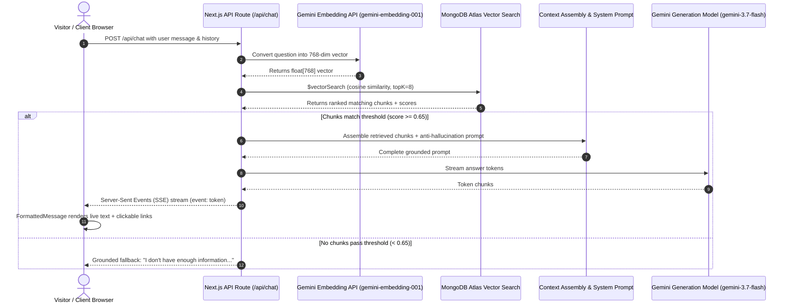

# System Architecture & Workflow Guide
### Personal AI Knowledge System for Muhammad Zohaib

---

## 1. Executive Overview

**Ask My Digital Twin** is an intelligent, production-quality personal knowledge system. It acts as an interactive digital representative of **Muhammad Zohaib** (Full-Stack Web Developer & MERN/Vue.js Engineer).

Visitors can ask questions about Zohaib's:
- Professional background & education
- Top live production projects (TruckFlow, Start2Write, Meat Zoo, DIGIMAG, etc.)
- Technical skill set (MERN Stack, Vue.js, Next.js, WebSockets, MongoDB, AWS)
- Work experience (Sideline Technologies, Ropstam Solutions, Freelancing)
- Services offered & how to hire him on Fiverr, LinkedIn, or Email

The core philosophy of this system is **Strict Grounding**: it only answers questions using verified facts from Zohaib's personal knowledge base, eliminating unsupported assumptions or hallucinations.

---

## 2. The End-to-End Reply Lifecycle

When a visitor types a question (e.g., *"give me list of zohaibs projects"* or *"Who is Zohaib?"*), here is the exact step-by-step sequence that produces the real-time reply:



---

### Step-by-Step Breakdown

#### Step 1: User Types Question in Frontend UI
- The visitor types a query into the `ChatInput` component.
- The user message appears in the chat window, and `fetch('/api/chat')` is dispatched with `method: 'POST'`.

#### Step 2: Next.js API Route Receives Request
- File: `app/api/chat/route.ts`
- The route validates the payload, configures streaming headers (`Content-Type: text/event-stream`, `Cache-Control: no-cache`), and triggers `ragPipelineStream()`.

#### Step 3: Query Vectorization (Embedding Generation)
- File: `lib/embeddings.ts`
- The system calls Google Gemini's `gemini-embedding-001` model:
  ```ts
  const embedding = await generateEmbedding(question);
  ```
- **Validation**: Enforces that the returned embedding vector contains **exactly 768 dimensions**. If dimensions differ, an explicit runtime error is thrown rather than padding or truncating vectors.

#### Step 4: MongoDB Atlas Vector Search ($vectorSearch)
- File: `lib/retrieval.ts`
- The 768-dimension vector is sent to MongoDB Atlas inside an aggregation pipeline using the `$vectorSearch` stage:
  ```json
  {
    "$vectorSearch": {
      "index": "vector_index",
      "path": "embedding",
      "queryVector": [0.012, -0.045, ...],
      "numCandidates": 50,
      "limit": 8
    }
  }
  ```
- Atlas ranks all stored knowledge chunks by **cosine similarity**.

#### Step 5: Similarity Filtering & Anti-Hallucination Guardrail
- File: `lib/retrieval.ts` & `lib/rag.ts`
- Every retrieved chunk must have a similarity score of **at least 0.65** (configurable in `lib/config.ts`).
- **Strict Guardrail**: If **0 chunks** pass the threshold, the system **never calls Gemini**. It immediately replies:
  > *"I don't have enough information about that in my knowledge base."*
  This prevents the model from hallucinating or guessing answers outside of Zohaib's portfolio.

#### Step 6: Context Assembly & Prompt Construction
- File: `lib/prompt.ts`
- The retrieved knowledge chunks are formatted with clean metadata headers:
  ```text
  [Source 1: projects.md (projects)]
  ...chunk text with live URLs...
  ---
  [Source 2: faq.md (faq)]
  ...chunk text with live URLs...
  ```
- Combined with Zohaib's Digital Twin persona prompt instructing the model to:
  1. Only use supplied context.
  2. Always provide live links when discussing projects, websites, or contact info.
  3. Format URLs as clickable markdown links: `[Project Name](https://...)`.

#### Step 7: Real-Time Streaming Generation with Fallback Resiliency
- File: `lib/gemini.ts`
- Uses `gemini-3.7-flash` (with automatic failover to `gemini-3.5-flash` or `gemini-3.8-flash` if free-tier rate limits are reached).
- Streams generated text tokens chunk-by-chunk.

#### Step 8: Server-Sent Events (SSE) Protocol
- File: `app/api/chat/route.ts` & `components/chat/chat-container.tsx`
- Streamed over HTTP using the standardized SSE structure:
  - `event: sources` — List of referenced documents
  - `event: token` — Individual text tokens as they generate
  - `event: done` — Marks completion of the message stream

#### Step 9: Client-Side Rich Markdown & Clickable Link Rendering
- File: `components/chat/formatted-message.tsx`
- The client receives the stream and parses:
  - **Bold Text**: `**text**`
  - **Markdown Links**: `[TruckFlow](https://www.truckflowhq.com/)`
  - **Nested Bold Links**: `**[Meat Zoo](https://www.meatszoo.com/)**`
  - **Raw URLs**: `https://...`
- Transforms them into vibrant, clickable links with external link icons (`↗`) that open directly in a new tab.

---

## 3. The Knowledge Base Pipeline

All data about Muhammad Zohaib resides in pure Markdown files inside the `knowledge/` directory:

| Document | Content & Purpose |
|---|---|
| `personal.md` | Biography, background, location (Islamabad), language proficiencies, personal hobbies. |
| `projects.md` | Master project directory + detailed case studies for all 8+ live production websites (TruckFlow, Start2Write, Meat Zoo, DIGIMAG, DIGITALY, JobCrap, Minest, 90j Pages, Digital Twin). |
| `skills.md` | Core technical competencies (JavaScript, TypeScript, React, Vue.js, Node.js, Express, MongoDB, WebSockets, Tailwind CSS, AWS, Git). |
| `experience.md` | Commercial roles at Sideline Technologies (PVT) LTD, Ropstam Solutions Inc., and international freelancing. |
| `education.md` | University of Sahiwal, BS in Computer Software Engineering, 3.35 CGPA (Grade A). |
| `contact.md` | Email (`mzohaibch.07@gmail.com`), WhatsApp (+92 3431197504), Fiverr link, GitHub, LinkedIn. |
| `services.md` | Full-stack web development, MERN & Vue.js engineering, custom admin dashboards, WebSocket applications, and Fiverr hiring options. |
| `faq.md` | Direct answers to top questions visitors frequently ask. |
| `achievements.md` | Academic excellence, 5+ deployed dashboards, freelance delivery track record. |
| `certifications.md` | Degree qualifications and continuous technical learning. |

### How Ingestion & Deduplication Work (`scripts/ingest.ts`)

1. **Document Loading**: Reads all `.md` files in `knowledge/`.
2. **Text Cleaning & Chunking**: Cleans text and splits documents into sliding-window chunks (target: 800 characters, overlap: 200 characters).
3. **MD5 Hashing**: Computes an MD5 checksum of each chunk's content.
4. **Deduplication Check**: Queries MongoDB Atlas for existing hashes. Chunks whose content hasn't changed are **skipped** to save API embedding quota.
5. **Embedding Generation**: Only changed or new chunks are embedded using `gemini-embedding-001`.
6. **Upsert / Replacement**: Overwrites previous versions of chunks by `chunkId` to guarantee **no duplicate chunks**.
7. **Search Index Verification**: Automatically checks if MongoDB Atlas has the `vector_index` search index created, creating it via driver if missing.

---

## 4. Why the Admin Panel Exists (`/admin`)

The `/admin` route is designed as the owner's **Control Room** for Muhammad Zohaib:

1. **One-Click Re-Ingestion (No Terminal Required)**:
   - When you update a project link, add a new client, or edit your resume in `knowledge/`, you don't have to SSH into a server or run commands in terminal.
   - Simply open `/admin`, enter your secret, and click **"Run Ingestion"**. The system instantly vectorizes new data into Atlas.
2. **Chunk Inspector**:
   - View exactly how your documents were split into chunks, their character sizes, and their MD5 hashes.
3. **Atlas Search Index Monitor**:
   - Check if the vector search index is `READY`, inspect vector dimensions (768), and review cluster metrics.
4. **Isolated Vector Search Sandbox**:
   - Test search queries and see raw cosine similarity scores directly without cluttering the public chat.
5. **Security & Privacy**:
   - The Admin button is **completely hidden from public visitors** on the homepage and chat screen. It is only accessible if you navigate directly to `/admin` in your browser and provide the secret password configured in `.env.local`.

---

## 5. Configuration Reference (`lib/config.ts`)

All core parameters are centralized in `lib/config.ts`:

```ts
export const RAG_CONFIG = {
  embedding: {
    model: 'gemini-embedding-001',
    dimensions: 768, // Exact vector dimensions matched in Atlas
  },
  generation: {
    model: 'gemini-3.7-flash', // Primary verified LLM
    fallbackModels: ['gemini-3.5-flash', 'gemini-3.6-flash', 'gemini-3.5-flash-lite'],
    maxOutputTokens: 2048,
    temperature: 0.7,
  },
  retrieval: {
    numCandidates: 50,
    topK: 8, // Retrieves top 8 matching chunks for rich multi-project lists
    similarityThreshold: 0.65, // Minimum cosine similarity
  },
  mongodb: {
    database: 'ask-my-twin',
    collection: 'chunks',
    vectorIndex: 'vector_index',
  },
};
```

---

## 6. How to Update Data in Future

1. **Edit Markdown Files**: Open any file in `knowledge/` (e.g., `knowledge/projects.md` to add a new project).
2. **Re-Ingest**:
   - Option A (Terminal): Run `npm run ingest`
   - Option B (Browser UI): Go to `http://localhost:3000/admin`, enter your password, and click **"Run Ingestion"**.
3. Your Digital Twin will immediately start answering queries with the updated data!

---

## 7. Resolution of the 3 Critical Architecture Issues

For complete technical logs and matrices, see the standalone audit document:
[ARCHITECTURAL_ISSUES_RESOLUTION.md](file:///Users/muhammadzohaib/projects/My-Digital-Twin/ARCHITECTURAL_ISSUES_RESOLUTION.md).

### Issue 1: Verified Gemini Generation Models
* **Problem**: Theoretical model names (`gemini-3.8-flash`, older `gemini-2.0-flash`, `gemini-1.5-flash`) cause 404 deprecated or 503 high-demand errors.
* **Resolution**: Verified all available models live against `@google/genai`. Configured `gemini-3.7-flash` as primary generation model, with verified fallback models `['gemini-3.5-flash', 'gemini-3.6-flash', 'gemini-3.5-flash-lite']`. All verified models support streaming generation (`generateContentStream`).
* **Enforcement**: Centralized in `lib/config.ts` (with `process.env.GEMINI_MODEL` override) and automated sequential fallback in `lib/gemini.ts`.

### Issue 2: Verified Gemini Embedding Dimensions (768)
* **Problem**: Never assume vector dimensions or allow silent padding/truncating when feeding MongoDB Atlas Vector Search.
* **Resolution**: Model `gemini-embedding-001` was verified live to produce exactly **768 dimensions** with `outputDimensionality: 768`.
* **Enforcement**: In `lib/embeddings.ts`, a runtime assertion explicitly checks:
  ```ts
  if (embedding.length !== RAG_CONFIG.embedding.dimensions) {
    throw new Error(`Embedding dimension mismatch: expected ${RAG_CONFIG.embedding.dimensions}, but Gemini returned ${embedding.length}`);
  }
  ```
  Vectors are never padded, truncated, or silently resized. Atlas index `vector_index` is configured with `dimensions: 768`, metric: `cosine`.

### Issue 3: Verified Personal Knowledge Before Ingestion
* **Problem**: Architecture templates contained generic placeholders or unverified claims.
* **Resolution**: Audited all 10 markdown documents in `knowledge/`:
  - Verified Muhammad Zohaib's education: BS Software Engineering, University of Sahiwal, 3.35 CGPA (Grade A).
  - Verified commercial experience: Sideline Technologies (Vue.js Developer), Ropstam Solutions (MERN Developer), 5+ freelance client deliveries.
  - Verified 8 live web apps + URLs: TruckFlow, Start2Write, Meat Zoo, DIGIMAG, DIGITALY, JobCrap, Minest, 90j Pages.
  - Verified contact channels: Email (`mzohaibch.07@gmail.com`), Phone (`+92 3431197504`), Fiverr (`https://www.fiverr.com/s/lr9q0X7`), GitHub (`https://github.com/zohaib65-ch`).
  - Strict placeholder rule: Unconfirmed vendor certifications (e.g. AWS/GCP) in `certifications.md` explicitly contain `[PLACEHOLDER]`. Zero fabricated information.
  - Ingestion ran cleanly: 10 documents, 46 chunks stored in Atlas.

